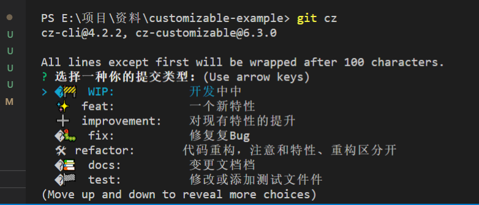
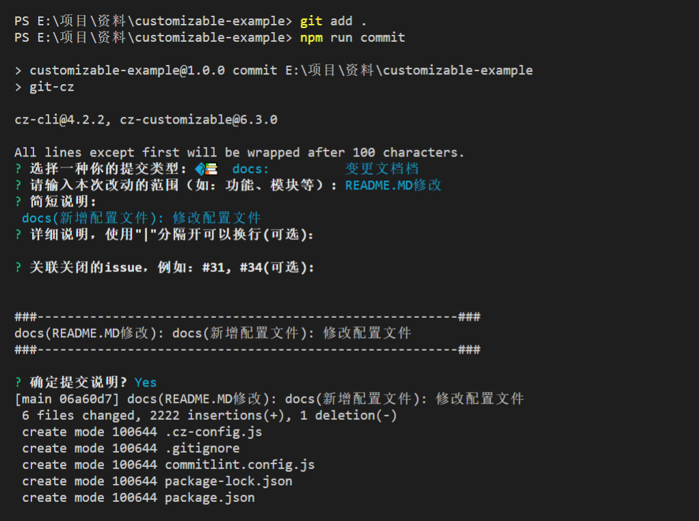
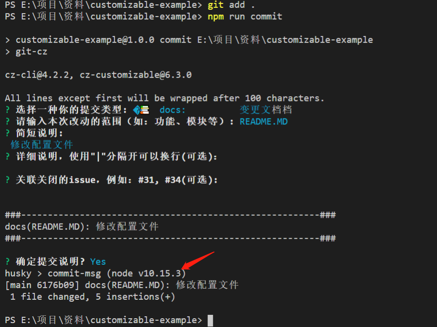

# customizable-example
采用了cz-customizable定制化提交说明的适配器、commitlint-config-cz @commitlint/cli+husky校验规则以及conventional-changelog日志生成器

> 如果想了解commit message 格式可以去看[cz-demo](https://github.com/lyxdream/cz-demo)，这里不做详细介绍

## 自定义 Adapter

>  有时候angular团队的那套规范会不合适自己团队的要求，这时候就需要定制一套自己的commit规范，cz-customizable是commitizen 的一个 adapter，格式类似上面的 cz-conventional-changelog ，但提供一定程度的自定义。
1、安装

    ```bash

    npm i -g cz-customizable
    //or
    npm i -D cz-customizable

```
修改 .czrc 或 package.json 中的 config 为:
```json 
{ "path": "cz-customizable" }
or
  "config": {
    "commitizen": {
      "path": "node_modules/cz-customizable"
    }
  }

```
向 package.json 添加新的 script：
```json
{
  "scripts" : {
    // ...
    "commit": "git-cz"
  }
}
```
执行`npm run commit` 就可以自动生成合格的 commit message

 > cz-customizable 自定义配置可以对上面的 type、scope、subject、body等进行设置与限定，例如设置type的种类、subject的字数、body的换行符等。
 方法是在项目根目录下新建 .cz-config.js 配置文件，在该文件中对上述字段设置规则。官方github上有给出该文件写法的一个示例。
 官方提供了一个.cz-config.js示例文件[cz-config-EXAMPLE.js](https://github.com/leoforfree/cz-customizable/blob/master/cz-config-EXAMPLE.js)，

 拓展了几个type类型，并对提示语进行了汉化。最后执行 npm run commit

  > 图标可以从找个网站找：[emoji图标](https://emojipedia.org/objects/)

运行效果如下：

 

 ## Commitlint: 校验你的 message

    ```bash
      npm i -D commitlint-config-cz @commitlint/cli
   ```
> commitlint-config-cz 合并 cz-customizable 的配置 {types,scopes,scopeOverrides} 和 commitlint 的配置 {type-enum,scope-enum}。这样，你就可以在一个地方维护 types 和 scopes。

#### 在项目中新建 commitlint.config.js 文件并设置校验规则：
```js
module.exports = {
  extends: ['cz'],
  rules: {
    // must add these rules
    'type-empty': [2, 'never'],
    'subject-empty': [2, 'never']
  }
};

```

#### 安装 husky，以在 commit message 时触发检验规则
1、安装husky
```bash
npm i husky -D
```
2、添加 git commit hooks 到 package.json：
```json 
{
  ...
  "husky": {
    "hooks": {
      "commit-msg": "commitlint -E HUSKY_GIT_PARAMS"
    }
  }
}

```

执行npm run commit,效果如下：

未配置husky前：



配置husky之后：




### 生成 CHANGELOG.md

用 conventional-changelog 生成 Change log

> conventional-changelog 是一款可以根据项目的 commit 和 metadata 信息自动生成 changelogs 和 release notes 的系列工具，并且在辅助 standard-version 工具的情况下，可以自动帮你完成生成 version、打 tag, 生成 CHANGELOG 等系列过程。

#### 安装

```bash
npm install -g conventional-changelog-cli
```

#### 基本使用

`conventional-changelog -p angular -i CHANGELOG.md -s`
> 上面命令不会覆盖以前的 Change log，只会在 CHANGELOG.md 的头部加上自从上次发布以来的变动。

> 如果想生成所有发布的 Change log，要改为运行下面的命令。

`conventional-changelog -p angular -i CHANGELOG.md -s -r 0`

为了方便使用，可以将其写入 package.json 的 scripts 字段。

```json
{
    "scripts": {
        "changelog": "conventional-changelog -p angular -i CHANGELOG.md -s -r 0"
    }
}
```

注意：

> -   type 为 feat 和 fix，perf，revert，则该 commit 将肯定出现在 Change log 之中。
> -   type 为 chore,ci,docs,refactor,style,test 加了 BREAKING CHANGES 会进去，不加不进去。
> -   release 不会出现在选择列表里目前没找到原因

生成的日志可查看示例：[CHANGELOG](https://github.com/lyxdream/cz-demo/blob/main/CHANGELOG.md)


### 扩展：

##### vscode commitizen
> 在 VS Code 中搜索装 vscode commitizen，然后就可以摆脱命令行了，而且这个插件是和前面所有的配置兼容的，效果如下：

#####  Vue CLI 3 插件
> 如果对于上述所说的配置感到繁琐，这里提供一个Vue CLI 3的插件，如果开发的项目由Vue CLI 3系统生成，可以使用插件@ziyi2/ui-cz一键生成：

```bash
vue add @ziyi2/ui-cz
```
> 该插件采用了cz-customizable定制化提交说明的适配器、@commitlint/config-conventional校验规则以及conventional-changelog日志生成器。


最后：

参考文章

[优雅的提交你的 Git Commit Message](https://juejin.im/post/6844903606815064077#heading-10)

[自动生成Change Log的实现开发目的](https://www.yuque.com/rocket/rocket_doc/huo1la)

[git commit规范及自动检查工具安装小记](https://juejin.im/post/6844904033635794958)


```
